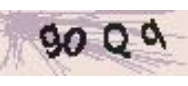



<style>
.space-before {
  padding-left: 1rem;
}
</style>

# Short Message Service (SMS) Guide

LeanCloud SMS makes it easy to incorporate SMS functionality into your application or project. With simple setup and minimum development effort, you can send SMS messages to [all major countries and regions](#pricing) around the world. Every SMS message sent from LeanCloud can be tracked from within your LeanCloud web console. <!-- (See [Delivery Status](#message-delivery-status))-->

<!-- Statistics show that SMS messaging is one of the most effective ways to send urgent or time-sensitive information to your customers. -->

LeanCloud SMS has no upfront costs, and you can pay as you go (see [the pricing](#pricing)). Before you start sending messages, make sure your [account balance](/dashboard/bill.html#/bill/charge/account) is sufficient to cover the cost of the messages.

<!--for only what you use. Your first **100 SMS messages** are free. Subsequent SMS messages are charged based on [the pricing](#pricing) below.
and the character limit depends on the encoding scheme. an SMS message can contain: 160 GSM characters, 140 ASCII characters, 70 UCS-2 characters-->

A standard SMS message can contain up to **70 Unicode characters**. Spaces and periods are also counted as characters. If you send a message that exceeds the size limit, the telecom carrier will use extra SMS messages, each fitting within **67 characters** to send it, and you will be charged accordingly. For example:

- A message of <span class="space-before">67</span> characters will be billed as 1 SMS message.
- A message of <span class="space-before">70</span> characters will be billed as 1 SMS message.
- A message of 134 characters will be billed as 2 SMS messages.
- A message of 140 characters will be billed as **3** SMS messages.<br/> (<small class="monospace">140 &divide; 67 = 2.1</small>)

You can send one complete message with a total of up to **400 characters** via our platform, this will need 6 SMS messages to send. The recipient sees a whole message on their device, not 6 of them though.

As an effective means of communication, SMS can be, if not securely protected, vulnerable to spamming attacks, causing financial loss and reputation damage to your business. For example, in an SMS bombing attack, cyber attackers would collect websites capable of sending SMS verification code while without requiring further authorization, and take advantage of them to send bulk SMS to phones. Consequently, those website owners would unfortunately have to pay for those verification code messages while phone owners would be annoyed by irrelevant messages within a certain period of time.

Therefore, developers should take prevention of such attacks seriously. At present, the graphic verification code (commonly known as [CAPTCHA](https://en.wikipedia.org/wiki/CAPTCHA)) is regarded the most effective way to defend against SMS bombing. LeanCloud offers CAPTCHA service *free of charge* as a good companion to LeanCloud SMS. The integration instructions can be found in the [CAPTCHA Service](#captcha-service) section.

## Pricing

The table below shows the price of sending each SMS message to a number in a given country. The country list will grow over time. If you can't find what you are looking for, please [let us know](/help) and we will help you out.
<!-- Geography Coverage -->

<script src="custom/js/lib/jquery.dataTables.min.js"></script>

<script type="text/javascript">
var smsPrices = [
    { 'CountryNumber': 1, 'CountryOrRegion': 'Canada', 'CountryCode': 'CA', 'UnitPrice': 0.009 },
    { 'CountryNumber': 1, 'CountryOrRegion': 'United States', 'CountryCode': 'US', 'UnitPrice': 0.009 },
    { 'CountryNumber': 7, 'CountryOrRegion': 'Kazakhstan', 'CountryCode': 'KZ', 'UnitPrice': 0.0396 },
    { 'CountryNumber': 7, 'CountryOrRegion': 'Russia', 'CountryCode': 'RU', 'UnitPrice': 0.0396 },
    { 'CountryNumber': 27, 'CountryOrRegion': 'South Africa', 'CountryCode': 'ZA', 'UnitPrice': 0.0324 },
    { 'CountryNumber': 30, 'CountryOrRegion': 'Greece', 'CountryCode': 'GR', 'UnitPrice': 0.0708 },
    { 'CountryNumber': 33, 'CountryOrRegion': 'France', 'CountryCode': 'FR', 'UnitPrice': 0.0912 },
    { 'CountryNumber': 34, 'CountryOrRegion': 'Spain', 'CountryCode': 'ES', 'UnitPrice': 0.1 },
    { 'CountryNumber': 39, 'CountryOrRegion': 'Italy', 'CountryCode': 'IT', 'UnitPrice': 0.106 },
    { 'CountryNumber': 40, 'CountryOrRegion': 'Romania', 'CountryCode': 'RO', 'UnitPrice': 0.0816 },
    { 'CountryNumber': 44, 'CountryOrRegion': 'United Kingdom', 'CountryCode': 'GB', 'UnitPrice': 0.05 },
    { 'CountryNumber': 49, 'CountryOrRegion': 'Germany', 'CountryCode': 'DE', 'UnitPrice': 0.102 },
    { 'CountryNumber': 52, 'CountryOrRegion': 'Mexico', 'CountryCode': 'MX', 'UnitPrice': 0.048 },
    { 'CountryNumber': 54, 'CountryOrRegion': 'Argentina', 'CountryCode': 'AR', 'UnitPrice': 0.0829 },
    { 'CountryNumber': 55, 'CountryOrRegion': 'Brazil', 'CountryCode': 'BR', 'UnitPrice': 0.0684 },
    { 'CountryNumber': 57, 'CountryOrRegion': 'Colombia', 'CountryCode': 'CO', 'UnitPrice': 0.078 },
    { 'CountryNumber': 58, 'CountryOrRegion': 'Venezuela', 'CountryCode': 'VE', 'UnitPrice': 0.0576 },
    { 'CountryNumber': 60, 'CountryOrRegion': 'Malaysia', 'CountryCode': 'MY', 'UnitPrice': 0.0484 },
    { 'CountryNumber': 61, 'CountryOrRegion': 'Australia', 'CountryCode': 'AU', 'UnitPrice': 0.0684 },
    { 'CountryNumber': 62, 'CountryOrRegion': 'Indonesia', 'CountryCode': 'ID', 'UnitPrice': 0.0346 },
    { 'CountryNumber': 63, 'CountryOrRegion': 'Philippines', 'CountryCode': 'PH', 'UnitPrice': 0.0516 },
    { 'CountryNumber': 65, 'CountryOrRegion': 'Singapore', 'CountryCode': 'SG', 'UnitPrice': 0.036 },
    { 'CountryNumber': 66, 'CountryOrRegion': 'Thailand', 'CountryCode': 'TH', 'UnitPrice': 0.0348 },
    { 'CountryNumber': 81, 'CountryOrRegion': 'Japan', 'CountryCode': 'JP', 'UnitPrice': 0.096 },
    { 'CountryNumber': 82, 'CountryOrRegion': 'Korea', 'CountryCode': 'KR', 'UnitPrice': 0.0564 },
    { 'CountryNumber': 86, 'CountryOrRegion': 'China', 'CountryCode': 'CN', 'UnitPrice': 0.0336 },
    { 'CountryNumber': 90, 'CountryOrRegion': 'Turkey', 'CountryCode': 'TR', 'UnitPrice': 0.0348 },
    { 'CountryNumber': 91, 'CountryOrRegion': 'India', 'CountryCode': 'IN', 'UnitPrice': 0.012 },
    { 'CountryNumber': 92, 'CountryOrRegion': 'Pakistan', 'CountryCode': 'PK', 'UnitPrice': 0.03 },
    { 'CountryNumber': 95, 'CountryOrRegion': 'Myanmar', 'CountryCode': 'MM', 'UnitPrice': 0.1572 },
    { 'CountryNumber': 351, 'CountryOrRegion': 'Portugal', 'CountryCode': 'PT', 'UnitPrice': 0.0612 },
    { 'CountryNumber': 852, 'CountryOrRegion': 'Hong Kong', 'CountryCode': 'HK', 'UnitPrice': 0.048 },
    { 'CountryNumber': 853, 'CountryOrRegion': 'Macau', 'CountryCode': 'MO', 'UnitPrice': 0.013 },
    { 'CountryNumber': 855, 'CountryOrRegion': 'Cambodia', 'CountryCode': 'KH', 'UnitPrice': 0.0528 },
    { 'CountryNumber': 856, 'CountryOrRegion': 'Laos', 'CountryCode': 'LA', 'UnitPrice': 0.0444 },
    { 'CountryNumber': 886, 'CountryOrRegion': 'Taiwan', 'CountryCode': 'TW', 'UnitPrice': 0.0648 },
    { 'CountryNumber': 960, 'CountryOrRegion': 'Maldives', 'CountryCode': 'MV', 'UnitPrice': 0.0156 },
    { 'CountryNumber': 966, 'CountryOrRegion': 'Saudi Arabia', 'CountryCode': 'SA', 'UnitPrice': 0.0372 },
    { 'CountryNumber': 971, 'CountryOrRegion': 'United Arab Emirates', 'CountryCode': 'AE', 'UnitPrice': 0.0372 },
    { 'CountryNumber': 977, 'CountryOrRegion': 'Nepal', 'CountryCode': 'NP', 'UnitPrice': 0.0516 },
    { 'CountryNumber': 998, 'CountryOrRegion': 'Uzbekistan', 'CountryCode': 'UZ', 'UnitPrice': 0.1038 }
];
</script>

<table class="datatable" cellspacing="0" cellpadding="0" width="100%" style="margin-top: 12px;">
    <thead>
        <tr>
            <th>Country or Region</th>
            <th>Country Code</th>
            <th>Calling Code</th>
            <th><strong>Price</strong></th>
        </tr>
    </thead>
    <tbody>
    </tbody>
</table>

<script type="text/javascript">
$(document).ready(function () {
    var smsPriceTable = $('.datatable').DataTable({
        data: smsPrices,
        // disable pagination
        paging: false,
        info: false,
        ordering: true,
        order: [[0, 'asc']],
        language: {
            zeroRecords: 'No result found.',
            search: '_INPUT_',
            searchPlaceholder: 'Enter country name, country code, or calling code to filter…'
        },
        columns: [
            { 'data': 'CountryOrRegion' },
            { 'data': 'CountryCode' },
            { 'data': 'CountryNumber' },
            { 'data': 'UnitPrice' }
        ],
        columnDefs: [
            {
                targets: [2],
                className: 'text-nowrap',
                render: function (data, type, row, meta) {
                    return '+' + data;
                }
            },
            {
                targets: [3],
                className: 'text-right text-nowrap',
                render: function (data, type, row, meta) {
                    return '<span class="text-muted" style="opacity: 0.5;">$</span><span style="display: inline-block; width: 5.5rem;">' + data.toFixed(4) + '</span>';
                }
            }
        ]
    });
    // style global filter
    $('.dataTables_filter')
        .find('label')
        .css({
            'display': 'flex',
            'white-space': 'nowrap',
            'align-items': 'center'
        })
        .find('input')
        .addClass('form-control');
        // .css({
        //     'flex-basis': '200px'
        // });
});
</script>

## Getting Started

Depending on the message content, LeanCloud classifies SMS messages into 3 categories:

- **Verification Code Message** contains a one-time passcode required by a service or a service provider for proceeding with a sensitive operation or an activity, such as password reset, financial transactions, etc. Example of a Verification SMS:
  <samp class="bubble highlight">G-978903 is your Google verification code.[GOOGLE]</samp>

- **Transactional Message** contains text which communicates details about a transaction, booking, service and product, such as purchase confirmations, shipping notifications, order status updates, etc. The message usually has been solicited by a user or customer. Example of a Transactional SMS:
  <samp class="bubble highlight">Your package AX-484-555 is delivered to 21 Layson Street Post Office.[UPS]</samp>
  {{ docs.alert("Transactional messages should never be intended for marketing.")}}

- **Promotional/Marketing Message** contains text which promotes your products and servers, such as offers, discounts, promotions, and any other type of marketing content your customers want to see. The message may or may not be solicited by the recipient. All bulk SMS are regarded as promotional SMS. Example of a Promotional SMS:
  <samp class="bubble highlight">We are running a special offer today for our select customers, call 400275555 or use coupon code BOOT50 to get 50% discount off your online orders.[BEE]</samp>

### Prerequisites

You use LeanCloud SMS APIs to send SMS messages. Those APIs are part of LeanCloud Storage SDK. You can follow the [SDK Setup](storage-guide-js.html#installing-sdk) document to load LeanCloud Storage SDK into your app or project.

After you install the dependencies, you must complete the following configuration steps:

1. Go to [LeanCloud web console > App Settings > Security Center](/dashboard/app.html?appid={{appid}}#/security), switch on the **SMS** option. Doing so will let the cloud respond to SMS related requests sending from your app.
1. Go to your app's [SMS Settings](/dashboard/messaging.html?appid={{appid}}#/message/sms/conf), check the **Enable Verification-code SMS (allow access to   requestSmsCode & verifySmsCode API)** option. *Please note that this option has nothing to do with the [AVUser authentication](#avuser-integration).*

### SMS Signature

An SMS Signature is a piece of information about the message sender. It can be the name of your app, your company, or your brand, but should be easy for the recipients to recognize. It will be automatically added to the beginning or the end of the message body, adding up to the total length of the message. The presence of signature is mandatory, any messages without it will be rejected by the telecom carrier.

To create an SMS signature, head over to your app's [Messaging > SMS > Settings](/dashboard/messaging.html?appid={{appid}}#/message/sms/conf) page and click on the **Create SMS Signature** button to add one. Your new SMS signature will be ready for use after passing our review.

Each LeanCloud app can have up to 50 SMS signatures. If there is more than one signature in an app, you need to make one of them as **the default signature**.

{{ docs.alert("Apps having no signature or no default signature will not be able to send any SMS messages.") }}

### Account Balance Alert

When your account balance goes low, you may not be allowed to send as many SMS messages as you intend to. To prevent it from happening, you may want to set a limit on your LeanCloud account balance so that you will get notified via email and SMS once that limit is reached. This option comes handy especially when you send bulk SMS. The limit setting can be found on your account's [Settings > Alerts](/dashboard/settings.html#/setting/alert) page. You may also want to designate a phone number and an email address for the alert to be sent to, all can be set up in the same place.


Please be warned that your account will be suspended once it runs out of balance. LeanCloud will not respond to any requests coming from the apps under a suspended account and all user data remains invisible until your bill is paid off.

<!-- (thus no statistics data will be captured or generated) -->

If you don't settle your bill within 30 days since suspension of your account, your apps and data will be deleted permanently from the cloud. This action cannot be reversed.

<!-- **Daily Spending Limit**:  -->

### Local Messaging Regulations and Restrictions

To reduce SMS spam and abuse, telecom carriers carry out various restrictions on sending messages to or from a country or region.

For example, in China, any messages containing adult, religious and political messages will be blocked. Known filtered keywords include: Falung Gong, SB, Tiananmen Square, or keywords in the category of gambling, adult content, property, migration, financial services, loans, beauty care, cosmetic surgery, healthcare, alcohol. In India, promotional SMS messages may only be sent between 9am and 9pm standard India time. This means your messages could be blocked or delayed if you send outside of these times, depending on the operator.

So it's a good idea to check the regulations for the destination phone number to ensure compliancy with all SMS regulations.

<!-- all message content templates must be provided in advance for screening by Chinese telecom authorities. LeanCloud strives to use the best connectivity for delivery to China. To ensure optimal and high performance of our API platform and delivery of messages on a direct routing class, we may use up to three or four local providers or operator connections for delivery to Chinese operators. -->

<!-- Any promotional message must be appended with a digital signature (based on route being used) in order to identify the source of the message. -->

<!-- Your messages (non-concatenated) may contain up to 130 characters for ASCII or 65 characters for UCS2, while concatenated messages may be up to 62 characters in length, and don't support ASCII. -->

<!-- URL links are not permitted in SMS messages, and any messages containing links will be blocked. -->

## Formatting Phone Numbers

When you send an SMS message, specify the phone number using the **E.164 format**. E.164 is a standard for the phone number structure used for international telecommunication. Phone numbers that follow this format can have a maximum of 15 digits, and they are prefixed with the plus character (+), the country calling code (and the local area code if applicable). For example:

Country  | Country Code | Subscriber Number | E.164 Format
---|---|---|---
US | 1 | (760)555-8671 | +17605558671
UK |44 | 07911 123456 | +447911123456
CN | 86 | 186-2503-8918 | +8618625038918

Two important things to note: First of all, in the international E.164 notation a leading "0" is removed. The UK mobile phone number "07911 123456" in international format is "+44 7911 123456", so without the first zero. Secondly in the E.164 notation all spaces, dashes `-` and parentheses `()` are removed. Besides the leading `+`, all characters should be numeric.

If you are unsure of the correct country code, a good reference is this [Wikipedia page](https://en.wikipedia.org/wiki/List_of_country_calling_codes#Alphabetical_listing_by_country_or_region) that lists countries and their calling codes.

<!-- 
E.164 formatting for phone numbers entails the following:

- A + (plus) sign
- International Country calling code
- Local Area code
- Local Phone number -->

## Verification Code Message

As part of LeanCloud's account security offerings, our SMS API makes it simple to add phone verification to your application. It supports verification codes sent via **text** and [**voice**](#voice-verification-code).

A general implementation of phone verification entails the following steps:

1. Before user is about to perform a sensitive task or an action, they are prompted for authentication where they see a form containing an input field for entering a phone number the verification code will be sent to, and an input field for entering verification code, along with a button that says "Send Verification Code" sitting next to it.
1. When the "Send Verification Code" button is clicked, you call the `AV.Cloud.requestSmsCode` method with necessary parameters to instruct the cloud to send the message, provided that you have completed the steps described in the [Prerequisites](#prerequisites) section.
  While that user is waiting for the message to come through, you may consider disabling the "Send Verification Code" button to prevent user from triggering the Send action again because there are rules about how frequently a message can be sent. See [Sending Limitations on SMS Messages](#sending-limitations-on-sms-messages). Displaying a hint indicating how much time left for that user to request a new verification code usually creates a better user experience.
1. User receives the verification code, and submits the form with it. Then you can call the `AV.Cloud.verifySmsCode` method to validate the code.
  It is a good idea to check if the verification code entered meets the length requirement, or consists of all digits, etc. before you allow it to be submitted to the server. Doing so can save time and spare unnecessary traffic to the server which undoubtedly, will be rejected.


The `requestSmsCode` method can just work with a phone number being the only parameter. Suppose a user is going to change his password, and your app (named *Test*) asks for the verification code before letting him proceed:

```javascript
AV.Cloud.requestSmsCode('$MOBILE_PHONE_NUMBER').then(function(){
    // message was sent successfully
}, function(error){
    // handle errors
});
```
```curl
curl -X POST \
  -H "X-LC-Id: {{appid}}" \
  -H "X-LC-Key: {{appkey}}" \
  -H "Content-Type: application/json" \
  -d '{"mobilePhoneNumber": "$MOBILE_PHONE_NUMBER"}' \
  https://{{host}}/1.1/requestSmsCode
```

The code will send a message with the following content:


You are requesting SMS verification using Test service. 123456 is your verification code which will expire in 10 minutes.[Test]



The verification code LeanCloud sends is of **6 digits**. You can pass in more parameters to alter the content to a limited extent. For example:

```javascript
AV.Cloud.requestSmsCode({
    mobilePhoneNumber: '$MOBILE_PHONE_NUMBER',
    name: 'BigBang',
    op:   'changing your password',
    ttl:  5
}).then(function(){
    // message was sent successfully
}, function(error){
    // handle errors
});
```
```curl
# MUST use POST to send the request
curl -X POST \
  -H "X-LC-Id: {{appid}}" \
  -H "X-LC-Key: {{appkey}}" \
  -H "Content-Type: application/json" \
  -d '{"mobilePhoneNumber": "$MOBILE_PHONE_NUMBER","name":"BigBang","ttl":"5","op":"changing your password"}' \
  https://{{host}}/1.1/requestSmsCode
```

Now the message will look like this:
You are requesting <mark>changing your password</mark> using <mark>BigBang</mark> service. 123456 is your verification code which will expire in <mark>5</mark> minutes.[Test]


> At this point you may be wondering if it is possible to change other text than the parameterized values. The answer is YES. You can create your own templates to completely tailor the content to your liking. We will cover it in the [Customizing Message Content](#customizing-message-content) section.

Here is a list of parameters you can use with the `requestSmsCode` method.

| Parameter                                                            | Default           | Description                                                                                                                                                                                                               |
|----------------------------------------------------------------------|-------------------|---------------------------------------------------------------------------------------------------------------------------------------------------------------------------------------------------------------------------|
| `mobilePhoneNumber`<br/>{{ docs.paramAttr("string, **required**") }} |                   | the target phone number. See [Formatting Phone Numbers](#formatting-phone-numbers)                                                                                                                                        |
| `smsType`<br/> {{ docs.paramAttr("string") }}                        | sms               | whether to send the message via `sms` (text) or `voice`. See [Voice Verification Code](#voice-verification-code)                                                                                                          |
| `ttl`<br/> {{ docs.paramAttr("number") }}                            | 10                | how soon the verification code will expire (in minutes)                                                                                                                                                                   |
| `name`<br/> {{ docs.paramAttr("string") }}                           | *App's name*      | if omitted, defaults to your app's name.                                                                                                                                                                                  |
| `op`<br/> {{ docs.paramAttr("string") }}                             | SMS verification  | the action or operation that requires authentication in your app. Defaults to "SMS verification" if omitted.                                                                                                              |
| `template`<br/> {{ docs.paramAttr("string") }}                       |                   | template to use for sending messages with customized content. Required when sending transactional or promotional messages. If omitted, our platform will use a generic template instead. See [Customizing Message Content](#customizing-message-content). |
| `sign`<br/> {{ docs.paramAttr("string") }}                           | *default signature* | which SMS signature to use if there are more than one signature. If you have not created any templates, the default signature will be used regardless of the value of this parameter.                                     |

Verifying the verification code is quite straightforward. Just be careful that the Verification Code parameter comes first, then you are good to go. 

```javascript
AV.Cloud.verifySmsCode(
    // mind the order of these two parameters
    '$VERIFICATION_CODE',
    '$MOBILE_PHONE_NUMBER'
).then(function(){
    // validated
}, function(error){
    // validation failed
});
```
```curl
curl -X POST \
  -H "X-LC-Id: {{appid}}" \
  -H "X-LC-Key: {{appkey}}" \
  -H "Content-Type: application/json" \
  -d '{"mobilePhoneNumber":"$MOBILE_PHONE_NUMBER"}' \
  "https://{{host}}/1.1/verifySmsCode/$VERIFICATION_CODE"
```

### Voice Verification Code

If you choose to deliver the verification code via voice, our platform will initiate an actual call to the phone as requested and the verification code will be read (text-to-speech) to the person who answers the phone.

> Messages delivered via voice shares the standard text messaging rates, and it is faster, more reliable and more secure. That being said, it is practical to combine SMS and voice to achieve a better messaging delivery rate.

You can offer "Try using voice" option wherever SMS is used in your application. When user chooses that option, you simply provide the `requestSmsCode` method with an additional parameter `smsType` of `voice` along with the phone number.

```js
AV.Cloud.requestSmsCode({
  mobilePhoneNumber: '$MOBILE_PHONE_NUMBER',
  smsType: 'voice'
}).then(function() {
  // message was sent successfully
}).catch(function(error) {
  // handle errors
});
```
```curl
curl -X POST \
  -H "X-LC-Id: {{appid}}" \
  -H "X-LC-Key: {{appkey}}" \
  -H "Content-Type: application/json" \
  -d '{"mobilePhoneNumber": "$MOBILE_PHONE_NUMBER", "smsType":"voice"}' \
  https://{{host}}/1.1/requestSmsCode
```

Then you call the `verifySmsCode` method to validate the code.

## Transactional & Promotional Messages

Sending a transactional or promotional message is quite similar to [sending a verification code message](#verification-code-message) &mdash; you use the same `verifySmsCode` method with an additional parameter `template` plus the mobile phone number.

Transactional messages can be rejected by the carriers if they contain inappropriate content (i.e., marketing content), and you can also be blacklisted and lose the ability to send messages. To avoid this, we help you review your templates before you can use them in your code. More instructions can be found in [Customizing Message Content](#customizing-message-content) section.

There are a few requirements on sending promotional messages:

- Only non-individual accounts (Business or Enterprise) are permitted to send promotional messages.
- Your business name should be included in your messages, otherwise you won't be able to send any messages. LeanCloud preserves the right to pursue legal actions against fake names or any fraudulent conducts.
- The carrier will append an opt-out instruction (such as "Reply STOP to unsubscribe.") to every promotional message. This is mandatory and cannot be changed.
- When you submit your promotional SMS template for the first time, we have to file the SMS signature linked with your template to the carrier for approval, which usually takes 2~5 work days. When it has been approved, sequential review of a new template can be completed within 4 business hours.

## Customizing Message Content

You can use SMS templates to customize message content for all your purposes. However, all templates have to go through our manual review to be approved as trustworthy before they can be used with our SMS API.

> Trustworthy content means there are no irrelevant or suspicious URLs, no violation of the local law or against telecom carriers' compliance requirements, which in turn ensures message deliverability. LeanCloud provides such compliance checking service at no extra charge for your message templates.

### Creating a Template

You can create a new template on your [LeanCloud web console > Messaging > SMS > Settings](/dashboard/messaging.html?appid={{appid}}#/message/sms/conf) page. After specifying the template name and the template type, you submit it for our approval.

The template type and its content must match. If you include any marketing content, for instance, in a non-promotional SMS template, the template will be rejected and won't be available for use with SMS API.

### Template Variables

The SMS template supports both **built-in variables** and **user-defined variables** which will be automatically populated when the message is being sent. These variables follows [Handlebars](http://handlebarsjs.com) syntax.

Built-in variables are:

- `name`: name of your app
- `code`: verification code (applicable only to Verification Code message)
- `ttl`: how soon the verification code will expire (default 10 minutes)
- `sign`: name of SMS signature to use
- `template`: name of the template

With the help of these variables, you can cook up your own verification messages if you prefer not using the default template. Let's say you want to verify user upon registration, and you can compose your template like this:


Thank you for creating an account with {{ docs.mustache("name") }}. Your verification code is {{ docs.mustache("code") }}. Please use it within the next {{ docs.mustache("ttl") }} minutes. Do not let other people know about the code.


The generated message will look like this:


Thank you for creating an account with BigBang. Your verification code is 123456. Please use it within the next 10 minutes. Do not let other people know about the code.[Test]


You can also create your own variables and use them in the template by simply passing them in as parameters through SMS API.

Suppose you have a pre-approved *transactional* message template named `delivery_notice_en_US` which contains a user-defined variable `order_id`, and your signature name is **general** which has a value of `TMALL`:


Your order #{{ docs.mustache("order_id") }} is being delivered to you. Please keep your phone handy in case our delivery guy might contact you. Thank you for your business.


Now you can use this template in your code like so:

```js
AV.Cloud.requestSmsCode({
  mobilePhoneNumber: '$MOBILE_PHONE_NUMBER',
  template:          'delivery_notice_en_US',
  sign:              'general'
  order_id:          '7623432424540'
}).then(function(){
  // message sent successfully
}, function(err){
  // error in sending message
});
```
```curl
curl -X POST \
  -H "X-LC-Id: {{appid}}" \
  -H "X-LC-Key: {{appkey}}" \
  -H "Content-Type: application/json" \
  -d '{"mobilePhoneNumber": "$MOBILE_PHONE_NUMBER","template":"delivery_notice_en_US","sign":"general","order_id":"7623432424540"}' \
  https://{{host}}/1.1/requestSmsCode
```

User will receive a message like this:


Your order #<mark>7623432424540</mark> is being delivered to you. Please keep your phone handy in case our delivery guy might contact you. Thank you for your business.[TMALL]


<!-- {{ docs.alert("The value of a user-defined variable cannot contain `[]` .") }} -->

### Caveats

**Links**: For security reasons, you should not put a URL in a variable, but you can use variables and text to construct a URL in your template. For example:
  
**INCORRECT**:
You can download our app from {{ docs.mustache("download_link") }}

CORRECT:
You can get the status of your package from here: http://www.sf-express.com/cn/#search/{{ docs.mustache("bill_number") }}


## CAPTCHA Service

LeanCloud CAPTCHA service can help developers avoid Internet robots from abusing and spamming their application or website. It keeps automated software from engaging in abusive activities while letting your valid users pass through with ease.

CAPTCHA usually takes the form of a random generated code appearing in an image above a textbox, and the visitor has to type the exact code into that textbox in order for the form information to be sent. Each time the form is accessed, a different code will appear.

We have put together a demo page using Javascript and HTML to demonstrate how you can use CAPTCHA as an extra security layer for user signin. The page renders like this:

<table>
  <tbody>
    <tr>
      <td>1.</td>
      <td>Phone Number</td>
      <td><input type="text" id="phone" /></td>
    </tr>
    <tr class="shade">
      <td>2.</td>
      <td>Enter text in box</td>
      <td><br /><input type="text" id="captcha-code" /></td>
    </tr>
    <tr>
      <td>3.</td>
      <td></td>
      <td><button id="verify">Get Verification Code</button></td>
    </tr>
    <tr class="shade">
      <td>4.</td>
      <td>Enter Verification Code</td>
      <td><input type="text" id="verification-code" /></td>
    </tr>
    <tr>
      <td>5.</td>
      <td>&nbsp;</td>
      <td><button>Sign in</button></td>
    </tr>
  </tbody>
</table>

<!--  -->

In step 2 one must enter the content of CAPTCHA correctly in order to get the verification code from the server in step 3. The "Sign in" step will succeed only when the verification code is completed properly and passes server validation.

{{ docs.alert("WARNING: If you swap step 3 and 4 with step 2, the protection mechanism discussed above will not work at all.") }}

Basically, integrating LeanCloud CAPTCHA takes the following steps:

1. Go into [LeanCloud web console > Settings > Security Center](/dashboard/app.html?appid={{appid}}#/security) and turn on the **CAPTCHA Service** option prior to your integration.
1. Load the supporting library *LeanStorage* into your project:
  ```
  <script src="//cdn1.lncld.net/static/js/2.3.2/av-min.js"></script>
  ```
1. Get a CAPTCHA image from the server and display it in the form.
  ```javascript
  AV.Captcha.request({
    width:  100, // image width
    height: 50,  // image height
  }).then(function(captcha) {
    console.log(captcha.url); // URL of CAPTCHA, to be used for rendering
  });
  ```
  ```curl
  curl -X GET \
    -H "X-LC-Id: {{appid}}" \
    -H "X-LC-Key: {{appkey}}" \
    -G \
    --data-urlencode 'width=100&height=50' \
    https://{{host}}/1.1/requestCaptcha
  ```
  You can use `AV.Captcha.request` to get an instance of `AV.Captcha` and then bind it with HTML form elements via the instance method `bind`.
  
  ```js
  AV.Captcha.request().then(function(captcha) {
    captcha.bind({
      textInput:    'captcha-code',   // id for textInput
      image:        'captcha-image',  // id for image element
      verifyButton: 'verify',         // id for verify button
    }, {
      success: function(verificationCode) {
        console.log('validation passed')
      },
      error: function(error) {
        console.error(error.message)
      },
    });
  });
  ```
1. Validate the CAPTCHA code user entered.

  ```javascript
  // captcha is the result returned by AV.Captcha.request()
  captcha.verify('$CAPTCHA_CODE').then(function(validateToken) {});
  ```
  ```curl
  curl -X POST \
  -H "X-LC-Id: nhx8Se7yQS93369ppncbv1Y8-gzGzoHsz" \
  -H "X-LC-Key: coULf9yviaemXwWqfle2Q0MM" \
  -H "Content-Type: application/json" \
  -d '{
        "captcha_code": "0000",
        "captcha_token": "R2cxkqSz"
      }' \
  https://nhx8se7y.api.lncld.net/1.1/verifyCaptcha
  ```
1. If validation is successful, use the token returned with the `validateToken` parameter to send SMS message.
  
  ```javascript
  AV.Cloud.requestSmsCode({
      mobilePhoneNumber: '$MOBILE_PHONE_NUMBER'
  }, {
      validateToken: '$VALIDATE_TOKEN'
  }).then(function(){
    // success
  }, function(error){
  });
  ```

  > If you'd like the server not to take SMS related requests unless they are pre-authorized by CAPTCHA, go into [LeanCloud web console > Messaging > SMS > Settings](/dashboard/messaging.html?appid={{appid}}#/message/sms/conf), check on the **Force SMS APIs to use CAPTCHA** option. Doing so will require the `validateToken` parameter to be present in all the SMS API calls.

Below is the source code of the demo page for you to examine.

```html
<!DOCTYPE html>
<html>
<head>
  <meta charset="utf-8">
  <meta name="viewport" content="width=device-width">
  <title>LeanCloud CAPTCHA Demo</title>
  <!-- load LeanCloud Storage SDK that includes CAPTCHA library -->
  <script src="//cdn1.lncld.net/static/js/2.3.2/av-min.js"></script>
</head>
<body>
<table>
  <tbody>
    <tr>
      <td>1.</td>
      <td>Phone Number</td>
      <td><input type="text" id="phone" /></td>
    </tr>
    <tr class="shade">
      <td>2.</td>
      <td>Enter text in box</td>
      <td><br /><input type="text" id="captcha-code" /></td>
    </tr>
    <tr>
      <td>3.</td>
      <td></td>
      <td><button id="verify">Get Verification Code</button></td>
    </tr>
    <tr class="shade">
      <td>4.</td>
      <td>Enter Verification Code</td>
      <td><input type="text" id="verification-code" /></td>
    </tr>
    <tr>
      <td>5.</td>
      <td>&nbsp;</td>
      <td><button>Sign in</button></td>
    </tr>
  </tbody>
</table>
<script>
  var appId  = '{{appid}}';   // Your AppId
  var appKey = '{{appkey}}';  // Your AppKey
  AV.init({ appId: appId, appKey: appKey });

  // creates an instance of AV.Captcha in default size
  AV.Captcha.request().then(function(captcha) {
    // bind with DOM elements
    captcha.bind({
      textInput:    'captcha-code',  // the id of the input tag
      image:        'captcha-image', // the id of image tag
      verifyButton: 'verify',        // the id of the button tag
    }, {
      success: function(validateToken) { 
        var phoneNumber = document.getElementById('phone').value;
        console.log('validation passed, sending SMS to phone:' + phoneNumber)
        AV.Cloud.requestSmsCode({
          mobilePhoneNumber: phoneNumber
          }, {
            validateToken: validateToken
          }).then(function(){
            console.log('message sent successfully')
          }, function(err){
            console.log('error in sending message:' + err.message)
        });
      },
      error: function(error) {
        console.error(error.message)
      },
    });
  });
</script>
</body>
</html>
```
 
When using `AV.Captcha.request` to create `AV.Captcha` instance, available parameters are:

| Parameter | Type | Default Value | Description |
| --- | --- | --- | --- |
| `width` | `Number` | `85` | The width of the CAPTCHA image in **px**, ranging from `60` to `200`. |
| `height` | `Number` | `30` | The height of the CAPTCHA image in **px**, ranging from `30` to `100`. |
| `size` | `Number` | `4` | The length of the verification code, ranging from `3` to `6` (**REST API** only; `masterKey` required). |
| `ttl` | `Number` | `60` | How soon the verification code expires in **seconds**, ranging from `10` to `180` (**REST API** only; `masterKey` required). |

The `bind` method of an `AV.Captcha` instance can take the following parameters:

| Parameter                                                         |  Description                        |
|-------------------------------------------------------------------|--------------------------|
| `textInput`<br/>{{ docs.paramAttr("string or HTMLInputElement")}} | the text input for entering the verification code. It can be the *id* value of the input tag or a reference to the `<input>` element. |
| `image`<br/>{{ docs.paramAttr("string or HTMLImageElement")}}     | the image that displays CAPTCHA content. It can be the *id* value of the image tag or a reference to the `` element. |
| `verifyButton`<br/>{{ docs.paramAttr("string or HTMLElement")}}   | the button for submitting user's input.  It can be the *id* value of the button or a reference to the `<button>` element. |

## Sending Limitations on SMS Messages

Telecom carries usually set strict rules on how frequently SMS messages can be sent in an effort to prevent SMS spamming and fraud. Violations of these rules will trigger a server warning of [601](error-code.html#601) that your message rate has been exceeded. Rules vary by SMS category, which are summarized below.

**Verification Code messages**: You cannot send more than 1 message to *the same phone number* in a 60-second window, or more than 3 messages in a 60-minute window, or more than 10 messages in a 24-hour window. For instance, if the first message was sent at 10:20 AM January 1 to phone A, only 9 messages can be sent to phone A before 10:20 AM January 2.

This applies to Voice Verification Code messages too.

Category|Time Window|Sending Limit
---|---|---
Verification Code|1 minute |1
Verification Code|1 hour|3
Verification Code|24 hours|10

**Transactional messages**: You cannot send more than 1 message to *the same phone number* in a 60-second window, or more than 15 messages within a calendar day (from midnight to midnight). The limit will be automatically reset at the start of the next day.

Category|Time Window|Sending Limit
---|---|---
Transactional|1 minute |1
Transactional|00:00~23:59|15

**Promotional messages**: Only *Business accounts* are allowed to send promotional messages.

> LeanCloud offers two account types: Business and Individual. There's no difference in the services or payment structure between Individual and Business accounts. After you activate your LeanCloud account as either a business or an individual, you can change your account type in [your Account Profile](/dashboard/settings.html#/setting/info) at any time.

All the above-mentioned limitations apply to the Sandbox Phone Number too.

> A [Sandbox Phone Number](storage-guide-js.html#sandbox-phone-number), once set up in your [SMS Settings](/dashboard/messaging.html?appid={{appid}}#/message/sms/conf), is bound with a fixed verification code which you can use to conveniently test your code without waiting for one to be actually sent through.

## Message Delivery Status

You can track the status of each message your application sent in [your LeanCloud web console](/messaging.html?appid={{appid}}#/message/sms/create) to understand whether it is queued, sent, delivered successfully, or not delivered by the carrier. The following table lists all possible statuses you may encounter:

<!-- In each case, that means the message was sent correctly by the handset or application, was properly encoded and segmented for the downstream carrier, navigated the global carrier network without incident, and was assembled and displayed correctly on the recipient's handset. If something went wrong along the way, an SMS tracker provides the insight needed to quickly diagnose what happened. It can determine when a delay or failure condition occurred and what part of the communication chain was responsible. -->

Status | To Be Billed | Note
---|:---:|---
delivered | Yes | LeanCloud has received delivery acknowledgement from the recipient's phone, message has been successfully delivered.
verified | Yes | The verification code submitted is valid (applies to the Verification Code message only)
pending | Yes | LeanCloud hasn't received delivery acknowledgement from the recipient's phone yet, the status is not clear at this stage. Delay may occur during peak time.
undelivered | Yes | The telecom carrier wasn't able to deliver the message to the target phone. (See [possible reasons](#factors-that-affect-message-delivery))
failed | **NO** | failed to instantiate LeanCloud SMS API to send the message.


## Factors that Affect Message Delivery

We take for granted that SMS messages arrive quickly and unscathed. Yet it almost always does. From the moment your application kicks off a new message to when that message reaches the recipient's phone screen, there are many possible points of failure. 

Let's take a look at some of the most common causes that messages may not be delivered, so that you may better understand how to make the best of the situation.

- The phone number is not valid or does not exist. <br/>End users buy new phones, change carriers and cancel contracts. When filling in a form, users fill in their phone number incorrectly. Due to these factors, there are always some invalid numbers in any database of users.
- The receiving phone is turned off or otherwise unavailable. <br/>If the user is out of reach, then the message will not be delivered to the handset at that moment. Generally, carriers work with a "store and forward" model in which they hold a message from 48 to 72 hours and if the phone is unavailable for this period, then the message will be discarded.
- The phone number can't receive the SMS, possibly because it is not a mobile number or is blocked.
- The content of the message is in violation of the carrier's rules. See [Local Messaging Regulations and Restrictions](#local-messaging-regulations-and-restrictions).
- Too many messages are sent too quickly.

## Troubleshooting Undelivered Messages

First of all, look into your SMS history in [your LeanCloud web console](/messaging.html?appid={{appid}}#/message/sms/create) for any trace of that problem phone number. If it isn't there, you may try looking for API errors and remedying your code.

If the phone number exists with an **undelivered** status, it may indicate that number is blacklisted by the telecom carrier because the owner of the phone had previously requested to be unsubscribed from the current SMS channel, or the phone number could be no longer available, or the receiving phone could be turned off.

For messages with a **delivered** status, even though they made it to the receiving phones, there's a chance that they could be screened or blocked by some security software installed on the phone.

So there really are a lot of factors that can affect the messaging deliverability. If you can't find any clue with your undelivered messages, please [contact support](mailto:support@leancloud.rocks) for assistance. *Including your AppId and the problem phone number(s) in your enquiry will definitely improve your response time*.

<!-- ### Why was I billed for more messages than I sent? -->

## AVUser Integration

Please refer to [LeanStorage Guide &middot; Users](storage-guide-js.html#signing-up-with-phones).